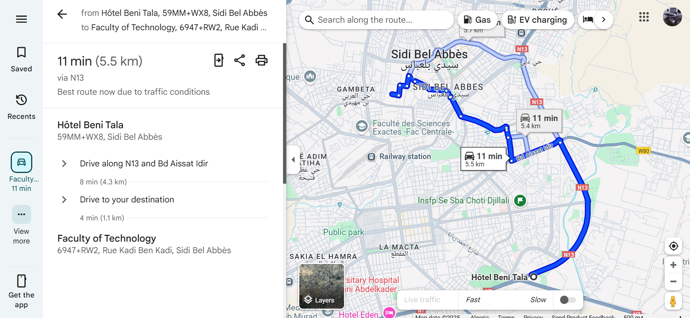
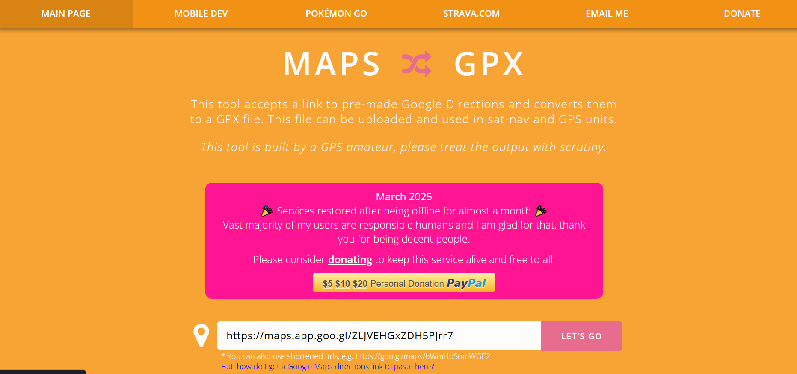

````markdown
# Creating GPS Datasets from Google maps roads

## Get the Map road from google maps

- Set the direction in google maps:


- Get the Link


- Use a GPX converter like mapstogpx.com


---

## GPX to CSV Converter for GPS Tracking Simulation

A simple Python command-line tool to convert `.gpx` files into `.csv` files.  
Useful for generating simulated GPS datasets from GPX traces (Google Maps, Strava, OpenStreetMap exports, etc).

---

## Installation

```bash
git clone https://github.com/AnesIDAW/GPS_Datasets_Creation.git
cd GPS_Datasets_Creation
pip install -e .
````

---

## Usage

### Command-line

```bash
gpx2csv path/to/input_file.gpx path/to/output_file.csv
```

### Example

```bash
gpx2csv examples/sba_to_temouchent.gpx output/sba_to_temouchent.csv
```

---

## How it works

* Reads GPX track points (`lat`, `lon`, `elevation`, `timestamp`)
* Converts timestamps to Excel datetime format
* Outputs `.csv` file:
  `latitude, longitude, elevation, speed_placeholder, excel_time, date, time`

| lat      | lon      | ele | speed | excel\_time | date       | time  |
| -------- | -------- | --- | ----- | ----------- | ---------- | ----- |
| 35.67891 | -0.45678 | 10  | 0     | 45123.4587  | 2025-07-15 | 11:00 |

---

## Example GPX Sources

* Google Maps (via My Maps)
* Strava Export
* OpenStreetMap exports

---

## Development

```bash
# Run tests (optional)
pytest tests/
```

---

## 💡 Why?

Quickly generate realistic datasets for GPS simulation, mapping apps, machine learning projects, and route analysis.

---

````